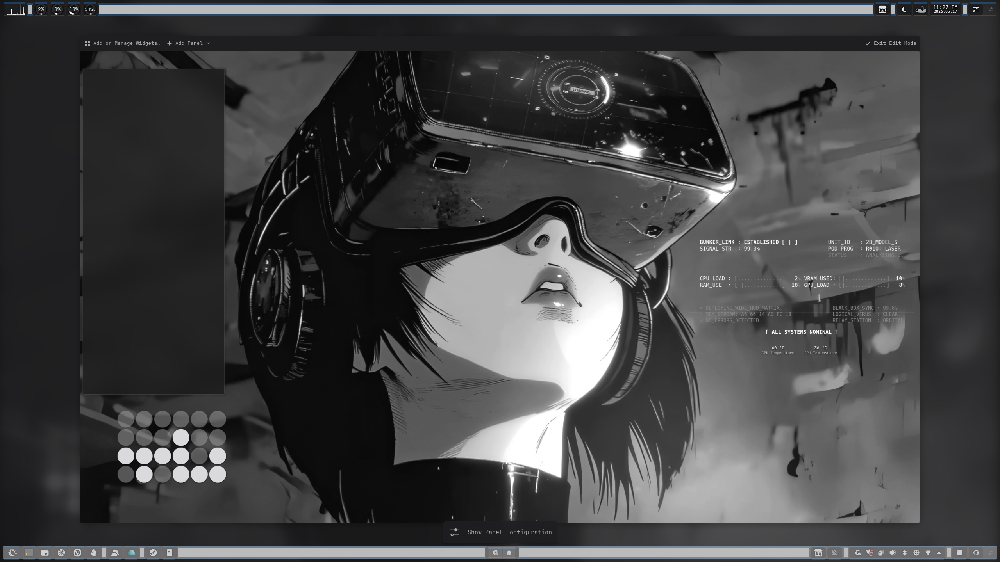
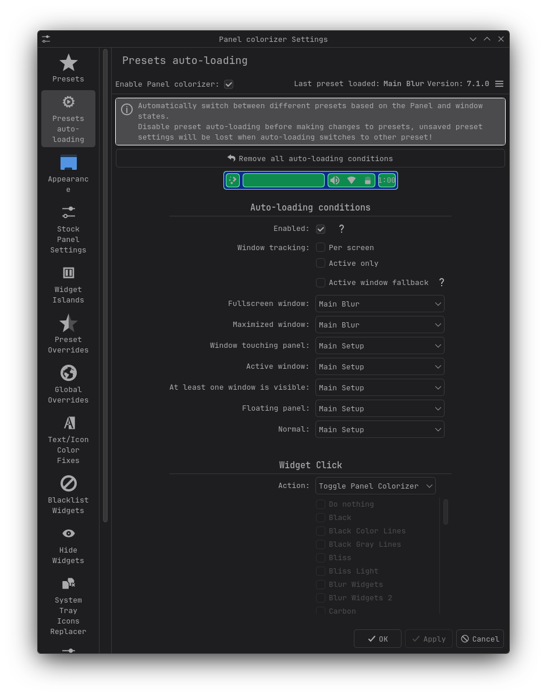
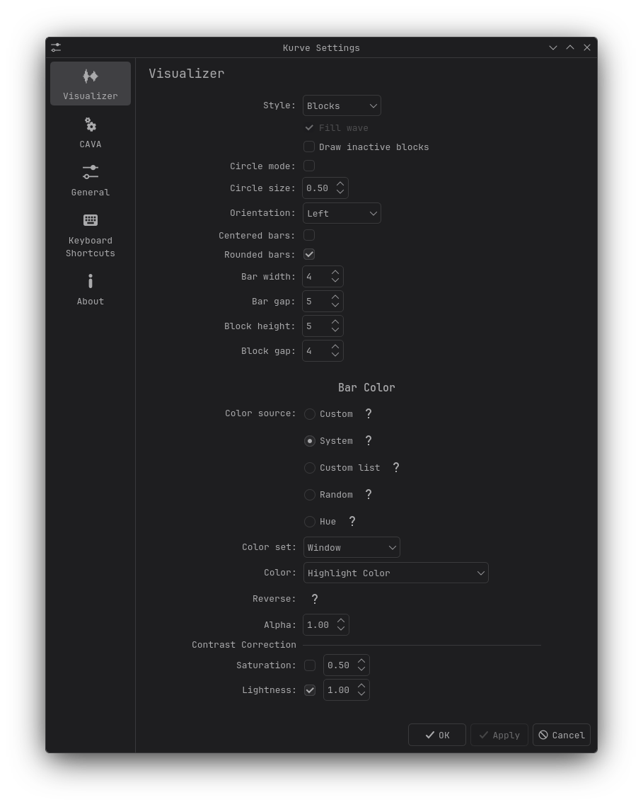
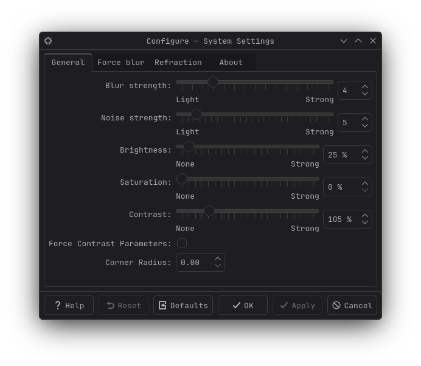
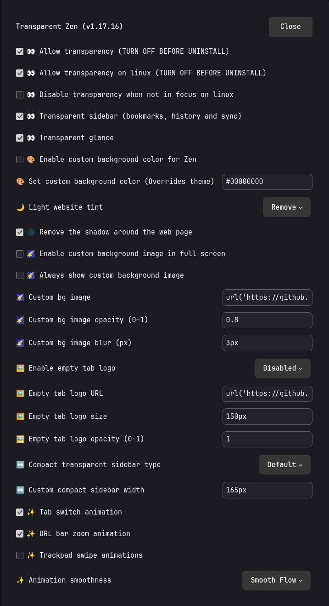

<div align="center">

# 🖤 null-sector-plasma

### Automated • Reproducible • Declarative KDE Plasma 6 Monochrome Rice
*(Inspired by [agridyne/dotfiles-dt](https://github.com/agridyne/dotfiles-dt) & NieR: Automata / Cyberpunk Aesthetics)*

[](https://archlinux.org/)
[](https://cachyos.org/)
[](https://kde.org/plasma-desktop/)
[](https://wayland.freedesktop.org/)
[](https://babashka.org/)
[](https://www.gnu.org/licenses/gpl-3.0)

<p align="center">
  A high-contrast <b>monochrome cyberpunk desktop environment</b> for <b>KDE Plasma 6 on Wayland</b>.<br />
  Engineered with <b>Panel Colorizer</b> floating capsule islands, <b>YoRHa HUD</b> telemetry, <b>Kurve</b> audio visualizer, <b>CatWalk</b> CPU monitor, <b>YAMIS</b> monochrome icons, <b>Konsole</b>, and <b>Zen Browser</b> translucent glass.<br />
  Driven by a declarative <b>Clojure (EDN) & Babashka</b> automation engine.
</p>

[Quick Start](#-quick-start) • [Design Specifications](#-design-specifications) • [Architecture](#-directory-tree--architecture) • [Post-Install Guides](#-component-configuration-guides) • [CLI Commands](#-cli-commands--babashka-tasks)

</div>

---

## 📸 Visual Showcase

<div align="center">

### Desktop Overview


| 🎛️ Panel Colorizer Presets | 🔊 Kurve CAVA Audio Visualizer |
| :---: | :---: |
|  |  |

| 🪟 KWin Wayland Force Blur | 🌐 Zen Browser Translucency |
| :---: | :---: |
|  |  |

</div>

---

## 💎 Design Specifications

| Component | Technology | Configuration Details |
| :--- | :--- | :--- |
| **Base System** | Arch Linux / CachyOS | KDE Plasma 6.7+, Wayland native, Linux Zen kernel |
| **Engine** | Babashka / Clojure (EDN) | Pure functional layout sanitization, sub-10ms startup |
| **Live Wallpaper** | [Smart Video Wallpaper Reborn](https://github.com/adhec/smart-video-wallpaper-reborn) | [DesktopHut Digital Gaze](https://www.desktophut.com/digital-gaze-8642) 4K video (fallback static PNG included) |
| **Theme & Colors** | [Monochrome KDE](https://github.com/pwyde/monochrome-kde) | Minimal high-contrast black & white palette |
| **Icon Theme** | [YAMIS](https://github.com/dirn/yet-another-monochrome-icon-set) | Adaptive monochrome vector icons across panel and desktop |
| **Cursor Theme** | `Bibata-Modern-Ice` | Crisp white minimalist cursor |
| **System Font** | `JetBrainsMono Nerd Font` | System-wide 10pt monospace font with icons |
| **Panels** | [Panel Colorizer](https://github.com/luisbocanegra/plasma-panel-colorizer) | Bundled `Main Setup` & `Main Blur` presets with floating capsules, auto-switched by window state |
| **Telemetry HUD** | [YoRHa HUD](https://github.com/AxZoRos/YoRHa-HUD) | *NieR: Automata* Bunker link telemetry widget on desktop |
| **Thermal Monitor** | [Thermal Monitor](https://github.com/olib14/thermal-monitor) | Direct hardware temperature telemetry (CPU/GPU) |
| **Audio Visualizer** | [Kurve](https://github.com/luisbocanegra/kurve) | Left-side CAVA desktop spectrum equalizer |
| **CPU Cat** | [CatWalk Enhanced](https://github.com/BLADR-ONE/CatWalk-Enhanced-Plasmoid) | Animated running cat scaled to processor load |
| **Terminal** | [Konsole](https://konsole.kde.org/) | Native KDE terminal emulator with JetBrainsMono Nerd Font |
| **Browser** | [Zen Browser](https://zen-browser.app/) | Glass translucency via `userChrome.css`, KWin Better Blur DX force blur, and auto-installed extensions/mods |

---

## 📂 Directory Tree & Architecture

```text
null-sector-plasma/
├── bb.edn                                # Babashka task configuration & test runner
├── rice.edn                              # Declarative rice manifest specification (EDN)
├── mono-rice                             # Direct standalone CLI entrypoint
├── bootstrap.sh                          # Non-interactive bootstrap wrapper
├── install.sh                            # Compatibility forwarding wrapper
├── harvest.sh                            # Compatibility forwarding wrapper
├── backup.sh                             # Compatibility forwarding wrapper
│
├── src/mono_rice/                        # Pure Clojure automation engine
│   ├── core.clj                          # Subcommand router & option parsing
│   ├── proc.clj                          # Process runner & logging
│   ├── fs.clj                            # Symlink deployment & backup engine
│   ├── deps.clj                          # Pacman / AUR / Git dependency resolver
│   ├── kde.clj                           # KDE Plasma 6 / KWin look & feel automation
│   ├── layout/
│   │   ├── sanitizer.clj                 # Deterministic appletsrc template engine
│   │   └── inspector.clj                 # DBus & INI widget introspection
│   ├── zen/
│   │   ├── profile.clj                   # Zen Browser profile manager & window rules
│   │   ├── policies.clj                  # Enterprise policies.json extension injector
│   │   └── mods.clj                      # Registry seeding & workspace gradient neutralizer
│   └── cmd/
│       ├── install.clj                   # Full deployment workflow
│       ├── harvest.clj                   # Scrape active configs into repo
│       ├── backup.clj                    # Snapshot creation
│       └── verify.clj                    # Diagnostic health verification
│
├── test/mono_rice/                       # Automated test suite
│   ├── sanitizer_test.clj
│   ├── manifest_test.clj
│   └── inspector_test.clj
│
├── plasma/                               # Tracked KDE configurations
├── kvantum/                              # Kvantum translucent theme engine
├── fastfetch/                            # Fastfetch system info
├── starship/                             # Minimal starship prompt
├── zsh/                                  # Zsh shell configuration
└── assets/                               # Wallpapers, SDDM & Plymouth themes
```

---

## ⚡ Quick Start

### 1. One-Liner Bootstrap
```bash
bash <(curl -s https://raw.githubusercontent.com/petrolal/null-sector-plasma/main/bootstrap.sh)
```

### 2. Manual Clone & Deployment
```bash
git clone git@github.com:petrolal/null-sector-plasma.git
cd null-sector-plasma

# Preview deployment without modifications:
bb install --dry-run

# Run complete deployment:
bb install

# Run diagnostic verification:
bb verify
```

---

## 🛠️ CLI Commands & Babashka Tasks

| Task / Command | Description |
| :--- | :--- |
| `bb install` (or `./mono-rice install`) | Deploys dependencies, plasmoids, wallpapers, themes, and panel layouts |
| `bb install --dry-run` | Simulates installation without modifying files |
| `bb install --deps-only` | Installs system packages and AUR extensions only |
| `bb install --symlinks-only` | Deploys dotfiles and configuration symlinks only |
| `bb harvest` (or `./mono-rice harvest`) | Scrapes live `$HOME` configurations back into repository with template sanitization |
| `bb backup` (or `./mono-rice backup`) | Creates timestamped backup snapshot under `~/.config_backup_mono_<timestamp>` |
| `bb verify` (or `./mono-rice verify`) | Diagnostic health check of packages, plasma widgets, and symlinks |
| `bb dump-widgets` | Pretty-prints live Plasma containments and plasmoid tree |
| `bb open-zen-mods` | Dispatches Zen Browser Mod install pages |
| `bb test` | Runs the automated Clojure test suite |
| `bb check` | Runs automated verification and backup sanity checks |

---

## 🛠️ Component Configuration Guides

### 🌐 Zen Browser Transparency & Blur
Fully automated by `bb install` except for one-click mod approvals:
1. `bb install` installs and configures `kwin-effects-better-blur-dx` for `zen` windows.
2. Bootstraps Zen profiles and symlinks `zen-browser/userChrome.css`, `userContent.css`, and `user.js`.
3. Injects Bonjourr, Dark Reader, and Zen Internet extensions via enterprise policies (`policies.json`).
4. Run `bb open-zen-mods` to open the mod install pages (install *Transparent Zen* and enable its Linux transparency toggle).

### 🔊 Kurve Audio Visualizer
1. Add the **Kurve** widget to your left desktop screen.
2. Set Style to `Blocks`, Orientation to `Left`, and Background to `Transparent`.
3. CAVA backend is automatically pre-configured.

---

## 📜 License
Released under the [GNU General Public License v3.0](LICENSE).
Monochrome theme by [pwyde](https://github.com/pwyde/monochrome-kde), YAMIS by [dirn](https://github.com/dirn/yet-another-monochrome-icon-set), YoRHa HUD by [AxZoRos](https://github.com/AxZoRos/YoRHa-HUD), CatWalk Enhanced by [BLADR-ONE](https://github.com/BLADR-ONE/CatWalk-Enhanced-Plasmoid).
Original rice inspiration from [agridyne/dotfiles-dt](https://github.com/agridyne/dotfiles-dt).
