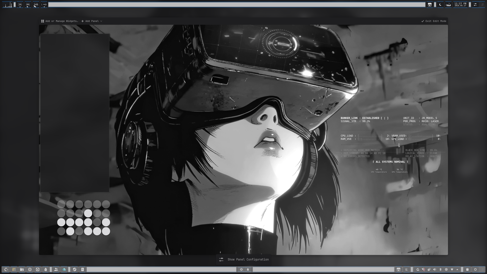
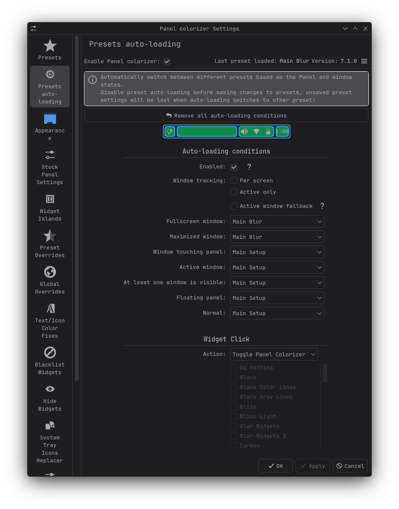
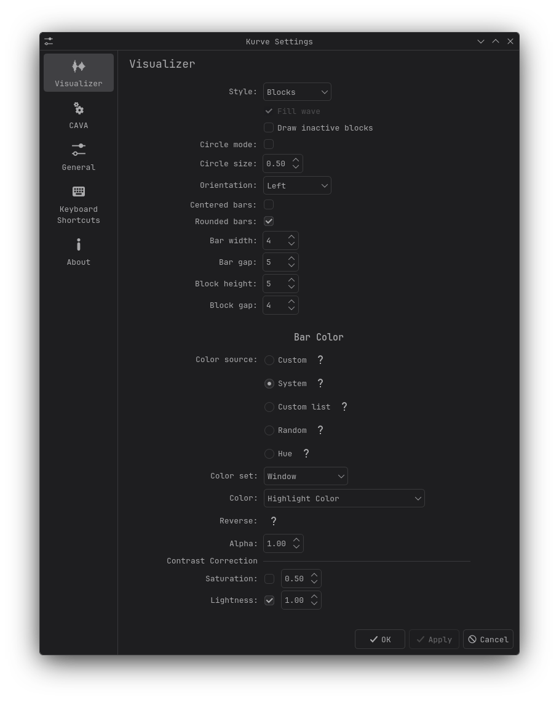
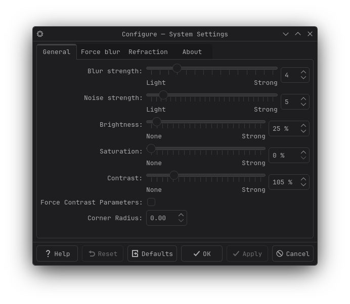
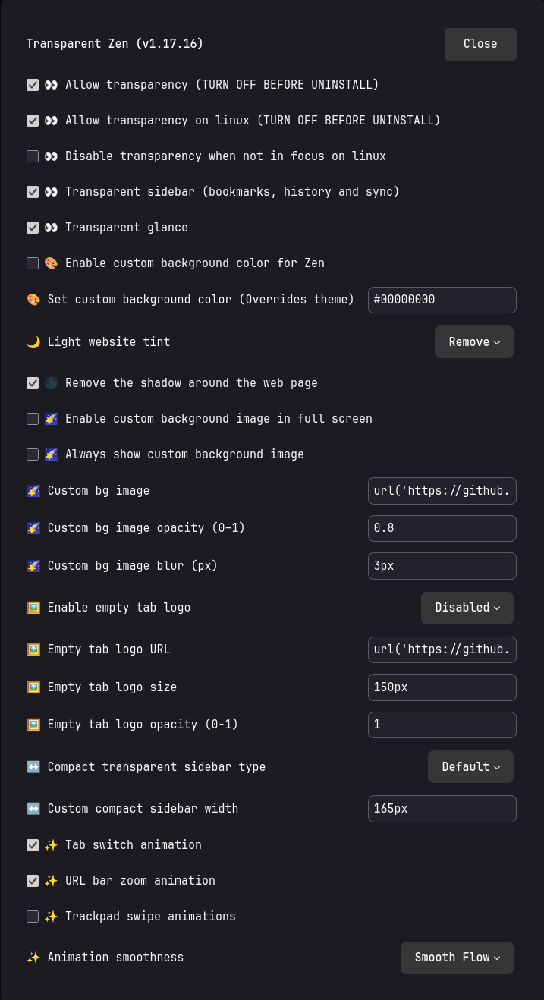

<div align="center">

# 🩸 sanguine-node-rice

### Automated • Reproducible • Declarative KDE Plasma 6 Biopunk Rice
*(Obsidian Monochrome • Sinister Crimson Accents • High-Performance Wayland)*

[](https://archlinux.org/)
[](https://cachyos.org/)
[](https://nixos.org/)
[](https://kde.org/plasma-desktop/)
[](https://wayland.freedesktop.org/)
[](https://babashka.org/)
[](https://www.gnu.org/licenses/gpl-3.0)

<p align="center">
  A high-contrast <b>sanguine obsidian desktop environment</b> for <b>KDE Plasma 6 on Wayland</b>.<br />
  Engineered with <b>Panel Colorizer</b> floating capsule islands, telemetry widgets, <b>CAVA</b> audio visualizer, <b>YAMIS</b> monochrome icons, <b>Konsole</b>, and <b>Zen Browser</b> translucent glass.<br />
  Driven by a declarative <b>Clojure (EDN) & Babashka</b> automation engine.
</p>

[Quick Start](#-quick-start) • [NixOS Guide](#-nixos-native-setup) • [Design Specifications](#-design-specifications) • [Architecture](#-directory-tree--architecture) • [CLI Commands](#-cli-commands--babashka-tasks)

</div>

---

## 📸 Visual Showcase

<div align="center">

### Desktop Overview


| 🎛️ Panel Colorizer Presets | 🔊 Kurve CAVA Audio Visualizer |
| :---: | :---: |
|  |  |

| 🪟 KWin Wayland Force Blur | 🌐 Zen Browser Translucency |
| :---: | :---: |
|  |  |

</div>

---

## 💎 Design Specifications

| Component | Technology | Configuration Details |
| :--- | :--- | :--- |
| **Base System** | Arch Linux / CachyOS / NixOS | KDE Plasma 6.7+, Wayland native |
| **Engine** | Babashka / Clojure (EDN) | Pure functional layout sanitization, sub-10ms startup |
| **Live Wallpaper** | [Smart Video Wallpaper Reborn](https://github.com/adhec/smart-video-wallpaper-reborn) | `infernal_naked_girl_biopunk.mp4` on Desktop & `infernal_eyes.mp4` on Lockscreen / Login Screen (with static PNG fallbacks) |
| **Theme & Colors** | [Monochrome KDE](https://github.com/pwyde/monochrome-kde) | Minimal high-contrast black & white palette |
| **Icon Theme** | [YAMIS](https://github.com/dirn/yet-another-monochrome-icon-set) | Adaptive monochrome vector icons across panel and desktop |
| **Cursor Theme** | `Bibata-Modern-Ice` | Crisp white minimalist cursor |
| **System Font** | `JetBrainsMono Nerd Font` | System-wide 10pt monospace font with icons |
| **Panels** | [Panel Colorizer](https://github.com/luisbocanegra/plasma-panel-colorizer) | Bundled `Main Setup` & `Main Blur` presets with floating capsules, auto-switched by window state |
| **Telemetry HUD** | [YoRHa HUD](https://github.com/AxZoRos/YoRHa-HUD) | *NieR: Automata* Bunker link telemetry widget on desktop |
| **Thermal Monitor** | [Thermal Monitor](https://github.com/olib14/thermal-monitor) | Direct hardware temperature telemetry (CPU/GPU) |
| **Audio Visualizer** | [Kurve](https://github.com/luisbocanegra/kurve) | Left-side CAVA desktop spectrum equalizer |
| **CPU Cat** | [CatWalk Enhanced](https://github.com/BLADR-ONE/CatWalk-Enhanced-Plasmoid) | Animated running cat scaled to processor load |
| **Terminal** | [Konsole](https://konsole.kde.org/) | Native KDE terminal emulator with JetBrainsMono Nerd Font |
| **Browser** | [Zen Browser](https://zen-browser.app/) | Glass translucency via `userChrome.css`, KWin Better Blur DX force blur, and auto-installed extensions/mods |

---

## 📂 Directory Tree & Architecture

```text
sanguine-node-rice/
├── bb.edn                                # Babashka task configuration & test runner
├── rice.edn                              # Declarative rice manifest specification (EDN)
├── mono-rice                             # Direct standalone CLI entrypoint
├── bootstrap.sh                          # Non-interactive bootstrap wrapper
├── install.sh                            # Compatibility forwarding wrapper
├── harvest.sh                            # Compatibility forwarding wrapper
├── backup.sh                             # Compatibility forwarding wrapper
│
├── src/mono_rice/                        # Pure Clojure automation engine
│   ├── core.clj                          # Subcommand router & option parsing
│   ├── proc.clj                          # Process runner & logging
│   ├── fs.clj                            # Symlink deployment & backup engine
│   ├── deps.clj                          # Pacman / AUR / Git dependency resolver
│   ├── kde.clj                           # KDE Plasma 6 / KWin look & feel automation
│   ├── theme.clj                         # Dynamic theme engine & multi-profile switcher
│   ├── layout/
│   │   ├── sanitizer.clj                 # Deterministic appletsrc template engine
│   │   ├── inspector.clj                 # DBus & INI widget introspection
│   │   └── scaling.clj                   # Resolution detection & panel geometry auto-scaling
│   ├── zen/
│   │   ├── profile.clj                   # Zen Browser profile manager & window rules
│   │   ├── policies.clj                  # Enterprise policies.json force-install extension setup
│   │   └── mods.clj                      # Mod registry seeding & workspace gradient neutralizer
│   └── cmd/
│       ├── install.clj                   # Full deployment workflow
│       ├── harvest.clj                   # Scrape active configs into repo
│       ├── backup.clj                    # Snapshot creation
│       ├── verify.clj                    # Diagnostic health verification
│       ├── doctor.clj                    # System health checks & auto-repair engine
│       ├── theme.clj                     # Dynamic theme switching CLI
│       ├── kwin.clj                      # Declarative KWin window rules & blur tuning
│       ├── fetch.clj                     # Fastfetch & terminal ASCII aesthetic manager
│       ├── profile.clj                   # Hardware profiler & form factor tuner
│       ├── watch.clj                     # Live configuration drift sentinel
│       ├── rollback.clj                  # Snapshot rollback & restore CLI
│       ├── diff.clj                      # Unified visual diff engine
│       ├── bundle.clj                    # Portable archive export & import CLI
│       ├── plasmoid.clj                  # Plasma 6 applet package manager
│       ├── tui.clj                       # Interactive terminal dashboard & menu
│       ├── daemon.clj                    # Systemd sentinel service & desktop notifications
│       ├── wallpaper.clj                 # Desktop & lockscreen 4K video wallpaper sync
│       └── audio.clj                     # CAVA / Kurve audio equalizer presets
│
├── test/mono_rice/                       # Automated test suite
│   ├── sanitizer_test.clj
│   ├── manifest_test.clj
│   ├── inspector_test.clj
│   ├── theme_test.clj
│   ├── scaling_test.clj
│   ├── watch_test.clj
│   ├── rollback_test.clj
│   ├── diff_test.clj
│   ├── bundle_test.clj
│   ├── plasmoid_test.clj
│   ├── tui_test.clj
│   ├── daemon_test.clj
│   ├── wallpaper_test.clj
│   ├── audio_test.clj
│   ├── doctor_test.clj
│   ├── kwin_test.clj
│   ├── fetch_test.clj
│   └── profile_test.clj
│
├── plasma/                               # Tracked KDE configurations
├── kvantum/                              # Kvantum translucent theme engine
├── fastfetch/                            # Fastfetch system info
├── starship/                             # Minimal starship prompt
├── fish/                                 # Fish shell configuration
└── assets/                               # Wallpapers, SDDM & Plymouth themes
```

---

---

## ⚡ Quick Start

### 1. One-Liner Multi-Distro Bootstrap (Arch / CachyOS / NixOS)
```bash
bash <(curl -s https://raw.githubusercontent.com/petrolal/sanguine-node-rice/main/bootstrap.sh)
```
The bootstrap script presents an interactive menu to choose your distro / installation method:
* **`[1] Auto-Install`**: Detects system and installs natively via Babashka.
* **`[2] Arch / CachyOS`**: Native Pacman, AUR, and KDE look-and-feel.
* **`[3] NixOS Quick Shell`**: Runs deployment inside `nix-shell` or `nix develop`.
* **`[4] NixOS System Flake Guide`**: Outputs declarative `configuration.nix` module snippet.
* **`[5] NixOS Home Manager Guide`**: Outputs declarative `home.nix` module snippet.
* **`[6] Dry-Run Simulation`**: Simulates full deployment without changing system files.

Non-interactive flags are also supported:
```bash
./bootstrap.sh --arch          # Arch Linux / CachyOS mode
./bootstrap.sh --nixos         # Run via nix-shell
./bootstrap.sh --flake         # Output NixOS flake module guide
./bootstrap.sh --home-manager  # Output Home Manager module guide
./bootstrap.sh --dry-run       # Dry-run validation
```

---

## ❄️ NixOS Native Setup

`sanguine-node-rice` provides 100% native support for NixOS via Flakes, standard `nix-shell`, and Home Manager.

### Option A: NixOS System Flake (`configuration.nix`)
Add the flake input and import the module:

```nix
# flake.nix
{
  inputs = {
    nixpkgs.url = "github:NixOS/nixpkgs/nixos-unstable";
    sanguine-node-rice.url = "github:petrolal/sanguine-node-rice";
  };

  outputs = { self, nixpkgs, sanguine-node-rice, ... }: {
    nixosConfigurations.myhostname = nixpkgs.lib.nixosSystem {
      system = "x86_64-linux";
      modules = [
        sanguine-node-rice.nixosModules.default
        {
          programs.sanguine-node-rice = {
            enable = true;
            enablePlymouth = true;   # dotLock boot splash theme
            enableSddm = true;       # null-sector-sddm theme
          };
        }
      ];
    };
  };
}
```

### Option B: Home Manager Module (`home.nix`)
```nix
{ inputs, ... }: {
  imports = [
    inputs.sanguine-node-rice.homeManagerModules.default
  ];

  programs.sanguine-node-rice.enable = true;
}
```

### Option C: Standalone Nix Shell
```bash
# In the cloned repository:
nix develop
# or with classic nix:
nix-shell
./mono-rice install
```

---

## 🛠️ CLI Commands & Babashka Tasks

| Task / Command | Description |
| :--- | :--- |
| `bb tui` (or `./mono-rice tui`) | Launches interactive Cyberpunk terminal dashboard and action menu |
| `bb doctor` (or `./mono-rice doctor`) | Runs deep health diagnostics across fonts, audio, compositor, and symlinks |
| `bb doctor --fix` | Automatically repairs broken symlinks, recreates configs, and refreshes caches |
| `bb install` (or `./mono-rice install`) | Deploys dependencies, plasmoids, wallpapers, themes, and panel layouts |
| `bb install --dry-run` | Simulates installation without modifying files |
| `bb install --deps-only` | Installs system packages and AUR extensions only |
| `bb install --symlinks-only` | Deploys dotfiles and configuration symlinks only |
| `bb harvest` (or `./mono-rice harvest`) | Scrapes live `$HOME` configurations back into repository with template sanitization |
| `bb backup` (or `./mono-rice backup`) | Creates timestamped backup snapshot under `~/.config_backup_mono_<timestamp>` |
| `bb rollback` / `bb rollback restore <name>` | Lists and restores timestamped configuration rollback snapshots |
| `bb diff` (or `./mono-rice diff [file]`) | Visual unified diff comparing repository templates with active `$HOME` dotfiles |
| `bb verify` (or `./mono-rice verify`) | Diagnostic health check of packages, plasma widgets, and symlinks |
| `bb theme list` / `bb theme set <name>` | Dynamic theme profile switcher (`monochrome-dark`, `monochrome-light`, `amber-crt`, `cyberpunk-red`) |
| `bb shortcut list` / `bb shortcut apply` | Declarative Plasma hotkeys and application shortcut orchestrator |
| `bb zen status` / `bb zen sync-css` | Zen Browser profile status, glass styling, and extension manager |
| `bb panel list` / `bb panel set <name>` | Panel Colorizer segmented capsule preset selector and hot-reloader |
| `bb kwin rules` / `bb kwin apply-rules` | Declarative window rules manager (Zen, Konsole, Discord, Spotify translucency) |
| `bb kwin set-blur <val>` | Adjusts KWin background blur shader strength (1-10) |
| `bb fetch list` / `bb fetch set <name>` | Fastfetch ASCII logo switcher (`arch`, `cachyos`, `nixos`, `fedora`, `nier-automata`, `null-sector`, `cyberpunk-skull`, `minimal-arch`) |
| `bb fetch preview <name>` | Previews any Fastfetch ASCII logo directly in your terminal |
| `bb profile detect` / `bb profile apply` | Hardware profiler detecting CPU/GPU/Form-factor with adaptive widget tuning |
| `bb sync status` / `bb sync pull` / `bb sync push` | Remote Git dotfile synchronization hub |
| `bb boot status` / `bb boot apply-sddm` | SDDM display manager & Plymouth boot splash theme orchestrator |
| `bb completion [fish\|zsh\|bash]` | Generates shell auto-completions for all 28+ subcommands (`--install`) |
| `bb vault scan` / `bb vault sanitize` | Security audit, credential leak scanner & dotfile secret sanitizer |
| `bb event listen` / `bb event emit <signal>` | DBus desktop event listener & dynamic display scaling sentinel |
| `bb wallpaper list` / `bb wallpaper set <name>` | Manages and syncs desktop & lockscreen 4K video wallpapers |
| `bb audio list` / `bb audio preset <name>` | Configures CAVA / Kurve audio equalizer presets on the fly |
| `bb watch` / `bb watch --once` | Configuration drift sentinel monitoring tracked dotfiles against templates |
| `bb daemon` / `bb daemon install-service` | Background systemd sentinel daemon with desktop notification alerts |
| `bb bundle export` / `bb bundle import <file>` | Exports or imports complete portable `.tar.gz` rice bundles |
| `bb plasmoid list` / `bb plasmoid install <path>` | Plasma 6 plasmoid applet installer, updater, and manager |
| `bb dump-widgets` | Pretty-prints live Plasma containments and plasmoid tree |
| `bb open-zen-mods` | Dispatches Zen Browser Mod install pages |
| `bb test` | Runs the automated Clojure test suite across all 26 modules |
| `bb check` | Runs automated verification, backup checks, theme, diff, and bundle checks |

---

## 🛠️ Component Configuration Guides

### 🌐 Zen Browser Transparency & Blur
Fully automated by `bb install` except for one-click mod approvals:
1. `bb install` installs and configures `kwin-effects-better-blur-dx` for `zen` windows.
2. Bootstraps Zen profiles and symlinks `zen-browser/userChrome.css`, `userContent.css`, and `user.js`.
3. Injects Bonjourr, Dark Reader, and Zen Internet extensions via enterprise policies (`policies.json`).
4. Run `bb open-zen-mods` to open the mod install pages (install *Transparent Zen* and enable its Linux transparency toggle).

### 🔊 Kurve Audio Visualizer
1. Add the **Kurve** widget to your left desktop screen.
2. Set Style to `Blocks`, Orientation to `Left`, and Background to `Transparent`.
3. CAVA backend is automatically pre-configured.

---

## 📜 License
Released under the [GNU General Public License v3.0](LICENSE).
Monochrome theme by [pwyde](https://github.com/pwyde/monochrome-kde), YAMIS by [dirn](https://github.com/dirn/yet-another-monochrome-icon-set), YoRHa HUD by [AxZoRos](https://github.com/AxZoRos/YoRHa-HUD), CatWalk Enhanced by [BLADR-ONE](https://github.com/BLADR-ONE/CatWalk-Enhanced-Plasmoid).
Original rice inspiration from [agridyne/dotfiles-dt](https://github.com/agridyne/dotfiles-dt).
