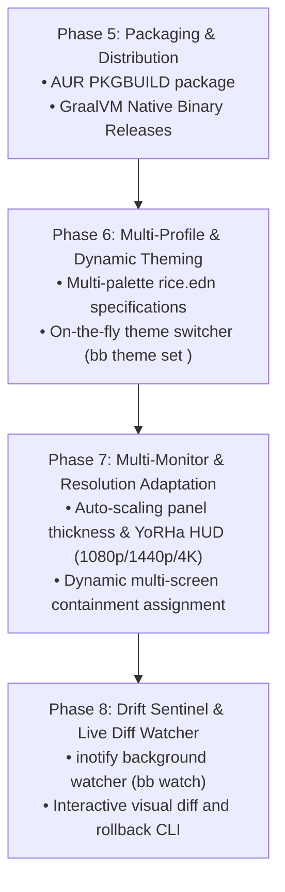

# 🪐 Architecture & Future Phases Roadmap

## 1. Project Overview & Philosophy

`null-sector-plasma` is an automated, reproducible, and declarative KDE Plasma 6 desktop environment ("rice") for Arch Linux and CachyOS on Wayland, styled with a high-contrast cyberpunk and NieR: Automata aesthetic.

The codebase is driven by a pure functional **Clojure / Babashka** automation engine (`mono-rice`), replacing legacy shell and Python scripts.

---

## 2. Current Implementation State (Completed Phases 1–4)

* **Phase 1: Foundation Setup**
  * Task configuration: [`bb.edn`](file:///home/petrolal/null-sector-plasma/bb.edn)
  * Declarative specification: [`rice.edn`](file:///home/petrolal/null-sector-plasma/rice.edn)
  * Core modules: [`mono_rice.proc`](file:///home/petrolal/null-sector-plasma/src/mono_rice/proc.clj), [`mono_rice.fs`](file:///home/petrolal/null-sector-plasma/src/mono_rice/fs.clj), [`mono_rice.kde`](file:///home/petrolal/null-sector-plasma/src/mono_rice/kde.clj)

* **Phase 2: Core Domain Logic**
  * Pacman / AUR / Git package resolver: [`mono_rice.deps`](file:///home/petrolal/null-sector-plasma/src/mono_rice/deps.clj)
  * Zen Browser glass translucency & policies: [`mono_rice.zen.*`](file:///home/petrolal/null-sector-plasma/src/mono_rice/zen)
  * Functional layout templating & sanitation: [`mono_rice.layout.sanitizer`](file:///home/petrolal/null-sector-plasma/src/mono_rice/layout/sanitizer.clj)

* **Phase 3: CLI Subcommand Architecture**
  * Modular command handlers under [`src/mono_rice/cmd/`](file:///home/petrolal/null-sector-plasma/src/mono_rice/cmd):
    * `install.clj` — Full non-destructive deployment pipeline
    * `harvest.clj` — Scrapes active `$HOME` configs back into repo with placeholder sanitization
    * `backup.clj` — Creates timestamped rollback snapshots in `~/.config_backup_mono_<timestamp>`
    * `verify.clj` — Health check of pacman/AUR packages, widget presence, and symlinks

* **Phase 4: Standalone Binary, Testing & CI**
  * Standalone executable: [`mono-rice`](file:///home/petrolal/null-sector-plasma/mono-rice) (`chmod +x`, sub-40ms startup)
  * Automated test suite under [`test/mono_rice/`](file:///home/petrolal/null-sector-plasma/test/mono_rice) (`bb test`)
  * GitHub Actions CI pipeline: [`.github/workflows/ci.yml`](file:///home/petrolal/null-sector-plasma/.github/workflows/ci.yml)
  * Compatibility shims for legacy scripts (`install.sh`, `harvest.sh`, `backup.sh`) forwarding to `bb`

---

## 3. Codebase Source Tree Map

```text
null-sector-plasma/
├── bb.edn                                # Babashka task manifest, test runner & nREPL task
├── rice.edn                              # Master EDN rice manifest
├── mono-rice                             # Direct executable wrapper (#!/usr/bin/env bb)
├── bootstrap.sh                          # Non-interactive shell bootstrapper
├── install.sh                            # Compatibility forwarder -> bb install
├── harvest.sh                            # Compatibility forwarder -> bb harvest
├── backup.sh                             # Compatibility forwarder -> bb backup
│
├── .github/workflows/
│   └── ci.yml                            # GitHub Actions CI (bb test & bb check)
│
├── src/mono_rice/
│   ├── core.clj                          # CLI option parsing (babashka.cli) & command router
│   ├── proc.clj                          # Shell execution helper (sh!), sudo wrapping, logging
│   ├── fs.clj                            # GNU Stow symlink engine, directory creation, backups
│   ├── deps.clj                          # Pacman / AUR (yay/paru) / Git dependency management
│   ├── kde.clj                           # kwriteconfig6, shortcuts, themes, KWin force-blur
│   │
│   ├── layout/
│   │   ├── sanitizer.clj                 # Plasma desktop-appletsrc template & pruning engine
│   │   └── inspector.clj                 # Live containment & plasmoid tree introspection
│   │
│   ├── zen/
│   │   ├── profile.clj                   # Profile discovery, CSS symlinks, KWin window rules
│   │   ├── policies.clj                  # Enterprise policies.json force-install extension setup
│   │   └── mods.clj                      # Mod registry seeding & mozLz4 gradient neutralizer
│   │
│   └── cmd/
│       ├── install.clj                   # mono-rice install workflow
│       ├── harvest.clj                   # mono-rice harvest workflow
│       ├── backup.clj                    # mono-rice backup workflow
│       └── verify.clj                    # mono-rice verify workflow
│
├── test/mono_rice/
│   ├── sanitizer_test.clj                # Unit tests for template replacement & panel pruning
│   ├── manifest_test.clj                 # Unit tests for rice.edn structure
│   └── inspector_test.clj                # Unit tests for INI parsing
│
├── plasma/                               # Modular tracked KDE configurations
├── kvantum/                              # Kvantum translucent theme engine
├── fastfetch/                            # Fastfetch configuration
├── starship/                             # Starship prompt configuration
├── zsh/                                  # Zsh shell configuration
└── assets/                               # Wallpapers, SDDM & Plymouth themes
```

---

## 4. Developer & Agent Workflow

### Running Commands
```bash
bb install --dry-run      # Preview full installation without changes
bb install                # Execute full installation
bb harvest                # Scrape active configurations from $HOME into repository
bb backup                 # Create timestamped configuration snapshot
bb verify                 # Check system dependencies, layout widgets, and symlinks
bb dump-widgets           # Print containment and plasmoid tree
bb open-zen-mods          # Open Zen Mod install URLs in browser
```

### Running Tests & Linting
```bash
bb test                   # Run full Clojure test suite
bb check                  # Run dry-run verification and backup checks
bb repl                   # Start nREPL server on port 1667
```

---

## 5. Future Phases Roadmap (Phases 5–8)



### 📦 Phase 5: Distribution & Binary Releases
* **Goal:** Allow zero-dependency distribution on Arch Linux / CachyOS and GitHub releases.
* **Tasks:**
  1. Create `PKGBUILD` for `null-sector-plasma-git` installing `mono-rice` to `/usr/bin/mono-rice` and shared assets to `/usr/share/null-sector-plasma/`.
  2. Implement GitHub Actions release pipeline building standalone GraalVM native binary (`mono-rice-linux-x86_64`).

### 🎨 Phase 6: Multi-Profile & Dynamic Theming Engine
* **Goal:** Enable live palette switching without restarting sessions.
* **Tasks:**
  1. Extend `rice.edn` to support multiple theme profiles (e.g., `:monochrome-dark`, `:monochrome-light`, `:amber-crt`, `:cyberpunk-red`).
  2. Implement `mono-rice.theme` namespace with `switch-theme!` function updating Kvantum colors, CAVA colors, Konsole color schemes, and Panel Colorizer presets on the fly.
  3. Expose CLI command: `bb theme set <profile-name>`.

### 🖥️ Phase 7: Multi-Monitor & Resolution Scaling Engine
* **Goal:** Automatically adjust panel dimensions and desktop HUD positions across arbitrary monitor setups.
* **Tasks:**
  1. Detect screen resolutions via `kscreen-doctor -o` or Wayland DBus protocols.
  2. Implement dynamic geometry scaling in `mono-rice.layout.sanitizer` (scaling panel height, font sizes, Kurve block heights, and YoRHa coordinates for 1080p, 1440p, 4K).
  3. Support secondary/tertiary monitor containment replication.

### 🛡️ Phase 8: Configuration Drift Sentinel (`bb watch`)
* **Goal:** Monitor system configuration files for unauthorized drift or widget corruption in real time.
* **Tasks:**
  1. Implement background daemon using `babashka.fs/watch` or `inotifywait`.
  2. Provide interactive CLI visual diff comparing `$HOME` configs against tracked repo templates with one-key merge or rollback.

---

## 6. Guidelines for Future AI Agents & Contributors

1. **Maintain Pure Clojure / EDN Architecture:**
   * Keep configuration data in `rice.edn` as EDN data structures rather than hardcoded script strings.
   * Put command workflows in `src/mono_rice/cmd/` and reusable domain logic in dedicated namespaces (`mono_rice.*`).

2. **Idempotency & Non-Destructive Safety:**
   * Every file mutation MUST support `--dry-run` (`-n`).
   * Never overwrite user files without first triggering a snapshot via `mono-rice.fs/backup-configs!`.

3. **Keep Tests Green:**
   * Whenever adding features or modifying sanitizer/inspector logic, add matching tests in `test/mono_rice/` and run `bb test`.
