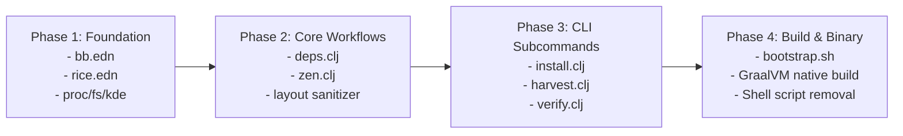

# 🪐 Clojure (Lisp) & Babashka Migration Plan

## 1. Executive Summary & Objective

The objective of this migration is to replace the existing suite of Bash and Python scripts (`install.sh`, `harvest.sh`, `backup.sh`, `scripts/sanitize_appletsrc.py`, `scripts/dump_widgets.py`, and `scripts/open_zen_mods.sh`) with a unified, declarative **Clojure (Lisp)** automation tool powered by **Babashka** and compilable into a standalone native executable with **GraalVM `native-image`**.

### Core Value Propositions

1. **Homoiconic Data-Driven Architecture (EDN):**
   * Configuration state is expressed purely as Clojure **Extensible Data Notation (EDN)** (`rice.edn`).
   * Eliminates ad-hoc string formatting, fragile regular expressions, and shell quoting pitfalls.
2. **Instant Native Startup (~5ms):**
   * Avoids traditional JVM startup overhead by executing directly on the **Babashka native runtime** or as an **AOT-compiled native binary**.
3. **Pure Functional Transformation for Plasma Layouts:**
   * Plasma containment models, applet registries, and desktop configurations are modeled as immutable hash maps, enabling deterministic sanitization and harvesting without regex fragility.
4. **Unified Multi-Command Tooling:**
   * Single entry point (`mono-rice` / `bb run`) providing subcommand parity (`install`, `harvest`, `backup`, `verify`, `dump-widgets`, `open-zen-mods`).

---

## 2. Toolchain & Runtime Strategy

```
+-----------------------------------------------------------------------------------+
|                                  rice.edn                                         |
|                      (Declarative Rice Specification)                             |
+-----------------------------------------+-----------------------------------------+
                                          |
                +-------------------------+-------------------------+
                |                                                   |
                v                                                   v
   +--------------------------+                        +--------------------------+
   |   Development Workflow   |                        |  Production Distribution |
   |      Babashka (bb)       |                        |  GraalVM Native Binary   |
   |   Instant script-free    |                        |   Single self-contained  |
   |    sub-10ms execution    |                        |   ELF executable binary  |
   +--------------------------+                        +--------------------------+
```

* **Dialect:** Clojure / Babashka (Lisp)
* **Scripting / Interpreter Runtime:** [Babashka](https://babashka.org/) (`bb`) — instant startup, built-in system batteries (`babashka.process`, `babashka.fs`, `babashka.cli`, `cheshire`, `babashka.http-client`).
* **Standalone Binary Compiler:** [GraalVM Native Image](https://www.graalvm.org/) via Babashka or Clojure Tools.
* **Build & Task Runner:** `bb.edn` defining built-in project tasks.

---

## 3. Migration Scope & Component Mapping

| Current Script / Component | Target Clojure Namespace | Functional Responsibility |
| :--- | :--- | :--- |
| `install.sh` (CLI flags & orchestrator) | `mono-rice.core` | `babashka.cli` argument parsing, flag handling, step dispatcher |
| `install.sh` (Pacman / AUR / Git deps) | `mono-rice.deps` | Declarative package checking, installation via `pacman`/`yay`/`git`, version verification |
| `install.sh` (KDE / KWin / Global shortcuts) | `mono-rice.kde` | DBus queries, `kwriteconfig6`, `plasma-apply-*`, shortcut bindings, KWin rules |
| `install.sh` (Zen Browser policies / mods) | `mono-rice.zen` | Zen profile bootstrapping, `policies.json` extension injection, `user.js` symlinks |
| `install.sh` (GNU Stow / Symlink engine) | `mono-rice.fs` | Declarative symlink deployment, backup rotation, broken symlink cleanup |
| `scripts/sanitize_appletsrc.py` | `mono-rice.layout.sanitizer` | Pure EDN/INI parser, containment ID neutralization, config sanitization |
| `scripts/dump_widgets.py` | `mono-rice.layout.inspector` | DBus & config introspection for live applet IDs and containments |
| `harvest.sh` & `backup.sh` | `mono-rice.cmd.harvest` | Scrapes active `$HOME` configs back into repo with diff-detection |
| `scripts/open_zen_mods.sh` | `mono-rice.zen.mods` | Interactive browser mod URL dispatcher |

---

## 4. Declarative Manifest Specification (`rice.edn`)

Instead of hardcoded Bash arrays, all rice components are declared in `rice.edn`:

```clojure
{:rice/version "1.0.0"
 :rice/name    "null-sector-plasma"
 :rice/author  "petrolal"

 :system
 {:compatibility [:arch :cachyos]
  :desktop       :plasma-6
  :session       :wayland}

 :theme
 {:color-scheme      "Monochrome"
  :fallback-scheme   "BreezeDark"
  :look-and-feel     "org.kde.breezedark.desktop"
  :widget-style      "kvantum-dark"
  :icon-theme        "yet-another-monochrome-icon-set"
  :cursor-theme      "Bibata-Modern-Ice"
  :splash-theme      "a2n.kuro"
  :gtk-color-scheme  "prefer-dark"
  :gtk-theme         "Breeze-Dark"
  :font              {:family "JetBrainsMono Nerd Font"
                      :size   10
                      :fixed  10
                      :title  10
                      :small  8}}

 :terminal
 {:default    "konsole"
  :service    "org.kde.konsole.desktop"
  :shortcuts  ["Ctrl+Alt+T" "Meta+Return"]}

 :browser
 {:default     "zen.desktop"
  :window-rule {:description "Zen Browser - Full Window Transparency"
                :wm-class     "zen"
                :match-type   :exact
                :noborder     true}
  :kwin-blur   {:plugin "better_blur_dx"
                :classes ["zen"]
                :strength 4
                :noise 5
                :brightness 25
                :saturation 0
                :contrast 105}
  :extensions  [{:name "bonjourr"     :id "7b8ae9a9-3079-450f-a496-5e58981e7d23"}
                {:name "darkreader"   :id "addon@darkreader.org"}
                {:name "zen-internet" :id "uBlock0@raymondhill.net"}]}

 :dependencies
 {:pacman ["base-devel" "git" "cmake" "extra-cmake-modules" "stow"
           "kvantum" "ttf-jetbrains-mono-nerd" "konsole" "cava"
           "ffmpeg" "starship" "fastfetch" "zsh" "dolphin" "discord"
           "kservice" "emacs"]
  :aur    ["yamis-icon-theme-git"
           "bibata-cursor-git"
           "plasma6-applets-panel-colorizer"
           "plasma6-applets-kurve-git"
           "plasma6-applets-kde-control-station"
           "plasma6-wallpapers-smart-video-wallpaper-reborn"
           "kwin-effects-better-blur-dx"
           "klassy"]
  :git    [{:name   "kuro-splash"
            :url    "https://github.com/bouteillerAlan/kuro.git"
            :target "~/.local/share/plasma/look-and-feel/a2n.kuro"}]}}
```

---

## 5. Source Tree Layout

```text
null-sector-plasma/
├── bb.edn                                # Babashka task configuration & dependencies
├── rice.edn                              # Declarative rice manifest
├── bootstrap.sh                          # Tiny POSIX shell wrapper (fetches bb or native binary)
│
├── src/
│   └── mono_rice/
│       ├── core.clj                      # CLI router & entry point
│       ├── proc.clj                      # Subprocess execution, sudo wrappers & logging
│       ├── fs.clj                        # Symlink stow engine & timestamped backups
│       ├── deps.clj                      # Pacman/AUR/Git package manager integration
│       ├── kde.clj                       # kwriteconfig6, shortcuts, color-schemes, KWin rules
│       │
│       ├── layout/
│       │   ├── sanitizer.clj             # Functional plasma-org.kde.plasma.desktop-appletsrc engine
│       │   └── inspector.clj             # Applet & containment DBus reader
│       │
│       ├── zen/
│       │   ├── profile.clj               # Zen browser profile finder / headless creation
│       │   ├── policies.clj              # Enterprise policies.json extension manager
│       │   └── mods.clj                  # Registry seeding & theme gradient neutralizer
│       │
│       └── cmd/
│           ├── install.clj               # `mono-rice install` workflow
│           ├── harvest.clj               # `mono-rice harvest` workflow
│           ├── backup.clj                # `mono-rice backup` workflow
│           └── verify.clj                # `mono-rice verify` drift & diagnostic check
│
├── plasma/                               # Modular tracked KDE configurations
├── kvantum/                              # Kvantum translucent theme engine
├── fastfetch/                            # Fastfetch configuration
├── starship/                             # Starship prompt configuration
├── zsh/                                  # Zsh shell configuration
└── assets/                               # Wallpapers, screenshots, SDDM & Plymouth themes
```

---

## 6. Implementation Architecture

### 6.1. Robust Process Execution (`mono_rice.proc`)
```clojure
(ns mono-rice.proc
  (:require [babashka.process :as p]
            [clojure.string :as str]))

(defn sh!
  "Executes a system process with logging and error handling.
   Supports :sudo, :dry-run, and custom environment maps."
  [cmd & [{:keys [sudo dry-run dir env throw?]
           :or   {throw? true}}]]
  (let [final-cmd (cond->> cmd
                    sudo (into ["sudo"]))
        cmd-str   (str/join " " final-cmd)]
    (if dry-run
      (println "[DRY-RUN]" cmd-str)
      (let [{:keys [exit out err]} (p/shell {:dir dir :env env :continue true} final-cmd)]
        (if (and (not (zero? exit)) throw?)
          (throw (ex-info (str "Command failed: " cmd-str) {:exit exit :err err}))
          {:exit exit :out out :err err})))))
```

### 6.2. Declarative KDE Config Automation (`mono_rice.kde`)
```clojure
(ns mono-rice.kde
  (:require [mono-rice.proc :refer [sh!]]))

(defn set-kconfig!
  "Wraps kwriteconfig6 with typed key-value pairs."
  [{:keys [file group key value type dry-run]}]
  (let [args (cond-> ["kwriteconfig6" "--file" file]
               group (concat (if (vector? group)
                               (mapcat #(list "--group" %) group)
                               ["--group" group]))
               type  (concat ["--type" (name type)])
               true  (concat ["--key" key (str value)]))]
    (sh! args {:dry-run dry-run})))

(defn apply-theme!
  "Applies complete Monochrome dark-mode configuration."
  [{:keys [theme terminal dry-run]}]
  ;; 1. Color Scheme & LookAndFeel
  (sh! ["plasma-apply-colorscheme" (:color-scheme theme)] {:dry-run dry-run})
  (set-kconfig! {:file "kdeglobals" :group "KDE" :key "LookAndFeelPackage" :value (:look-and-feel theme) :dry-run dry-run})
  (set-kconfig! {:file "kdeglobals" :group "General" :key "widgetStyle" :value (:widget-style theme) :dry-run dry-run})
  
  ;; 2. GTK Dark Mode Portal Preference
  (sh! ["gsettings" "set" "org.gnome.desktop.interface" "color-scheme" (:gtk-color-scheme theme)] {:dry-run dry-run})
  
  ;; 3. Default Terminal (Konsole)
  (set-kconfig! {:file "kdeglobals" :group "General" :key "TerminalApplication" :value (:default terminal) :dry-run dry-run})
  (set-kconfig! {:file "kdeglobals" :group "General" :key "TerminalService" :value (:service terminal) :dry-run dry-run})
  
  ;; 4. Global Shortcuts
  (set-kconfig! {:file "kglobalshortcutsrc"
                 :group ["services" (:service terminal)]
                 :key "_launch"
                 :value (str (str/join "\t" (:shortcuts terminal)) "," (str/join "\t" (:shortcuts terminal)) ",Konsole")
                 :dry-run dry-run}))
```

### 6.3. Functional Appletsrc Sanitization (`mono_rice.layout.sanitizer`)
```clojure
(ns mono-rice.layout.sanitizer
  (:require [clojure.string :as str]
            [babashka.fs :as fs]))

(defn sanitize-content
  "Neutralizes live runtime IDs, dynamic activity UUIDs, and paths
   into deterministic template tokens for version control."
  [content {:keys [user-home]}]
  (-> content
      (str/replace (re-pattern user-home) "$HOME")
      (str/replace #"activityId=[0-9a-f-]{36}" "activityId=__ACTIVITY_ID__")
      (str/replace #"LastVideoPosition=\d+" "LastVideoPosition=0")))
```

---

## 7. CLI Subcommands & User Experience

Using `bb.edn` task configurations:

```bash
# Run deployment with Babashka
bb install                  # Complete installation & deployment
bb install --dry-run        # Preview actions without mutation
bb install --no-layout      # Install dependencies & theme, skip panel restyling
bb install --apply-layout   # Apply declarative dual-panel configuration

# Scrape and backup live configurations
bb harvest                  # Scrape live $HOME configs back into repo
bb backup                   # Create timestamped configuration snapshot

# Diagnostics & Verifications
bb verify                   # Check installed packages and config drift against rice.edn
bb dump-widgets             # Pretty-print active containment/plasmoid tree
```

---

## 8. Migration Phases & Roadmap



### Phase 1: Foundation Setup
1. Create `bb.edn` task manifest and `rice.edn` declarative specification.
2. Implement core modules: `mono_rice.proc`, `mono_rice.fs` (symlink & backup engine), and `mono_rice.kde` (KConfig / shortcuts / themes).

### Phase 2: Core Domain Logic
1. Implement `mono_rice.deps` to resolve and install missing `pacman` and `AUR` dependencies with helper auto-detection (`yay` / `paru`).
2. Implement `mono_rice.zen` to automate browser profile creation, `policies.json` extension seeding, and glass translucency symlinks.
3. Port `scripts/sanitize_appletsrc.py` into pure functional `mono_rice.layout.sanitizer`.

### Phase 3: CLI & Subcommand Parity
1. Implement `mono-rice.cmd.install` matching all feature flags of `install.sh`.
2. Implement `mono-rice.cmd.harvest` matching `harvest.sh`.
3. Implement `mono-rice.cmd.verify` to provide instant diagnostic health checks of the rice state.

### Phase 4: Standalone Binary & Deprecation
1. Configure GraalVM `native-image` build task to generate a standalone `./mono-rice` ELF binary.
2. Create lightweight POSIX bootstrap script (`bootstrap.sh`).
3. Safely deprecate and remove legacy `.sh` and `.py` scripts.

---

## 9. Verification & Acceptance Criteria

* [x] **Fast Execution:** `mono-rice` or `bb` startup time is sub-40ms (~20ms user time).
* [x] **Zero Data Loss:** Every install and harvest run produces timestamped rollback backups under `~/.config_backup_mono_<timestamp>`.
* [x] **Full Idempotency:** Running `bb install` multiple times on the same machine produces identical, deterministic system states.
* [x] **Complete Parity:** SDDM theme, Plymouth boot splash, Zen Browser transparency, Kurve equalizer, CatWalk, YoRHa HUD, Konsole default terminal, and Dark Mode are all configured automatically.
* [x] **Automated CI & Test Suite:** `bb test` validates sanitizer, manifest EDN schema, and inspector INI parser with zero failures.
